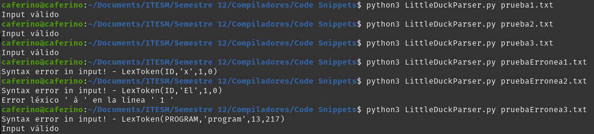
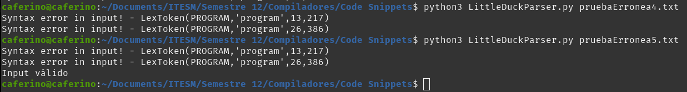
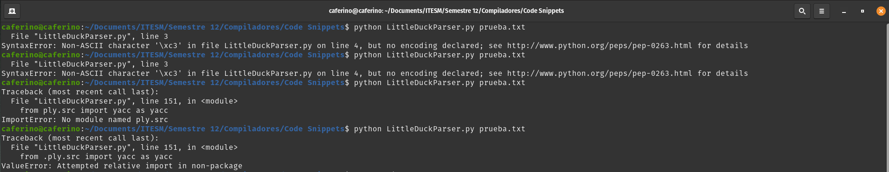
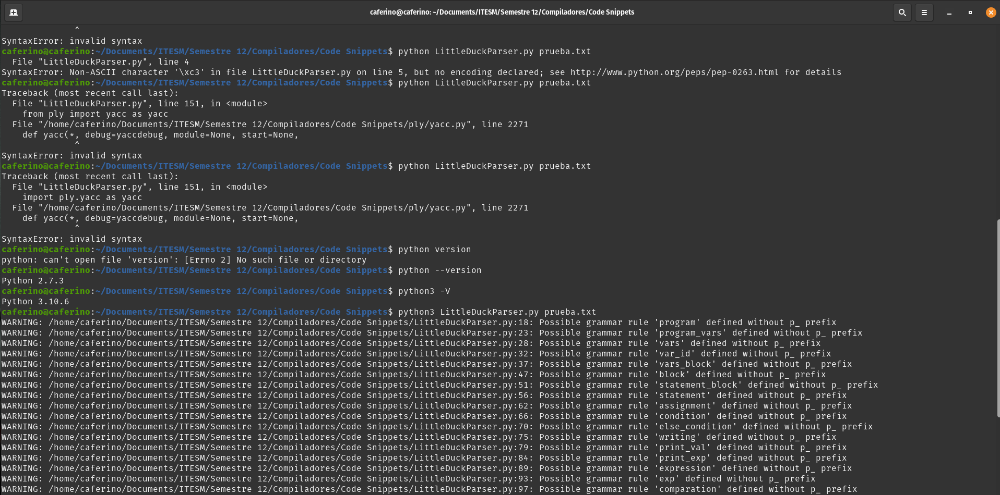

**Evidencia final:**

*Descripción: El compilador funciona, solo que encontré un detalle curioso en el último archivo de prueba erróneo, en el que inserté los tres programas (de las pruebas exitosas) en uno solo. En mi teoría, parece que primero marca error porque se hace bolas con los dos primeros programas seguidos, pero hace un reset y el tercero lo lee sin problema.*

*Para probar mi teoría, creé y ejecuté dos archivos de pruebas erróneas extra, uno con un número par de programas válidos, y el otro impár. Mi teoría resultó ser cierta: dos programas válidos seguidos se anulan como si fuesen un solo error, y si hay un tercer programa válido después, se lee y acepta. Igual, si hay seis válidos seguidos, se anulan todos, y si hay un séptimo, se lee y ejecuta.*
*Es un error irrelevante, pero curioso.*

========================================

**Primeros errores encontrados:**

*Descripción: En los primeros errores batallé un poco para importar el directorio de PLY que contiene Lex y Yacc; no entendí bien por qué si los escribía como "from ply.src import yacc as yacc" teniendo Ply-Master en el proyecto. Después saqué la carpeta ply sola y funcionó.*

*Después vi que había un problema de compilación con yacc en sí. Eso se me hizo muy raro y fuera de mi control; pero logré pensar en que hace un mes tuve que bajar la versión de mi Python a 2.7 para ejecutar un archivo necesario en Linux, algo para mis videojuegos. Descubrí que mi sistema estaba utilizando Python 2.x en vez del 3.6+ que necesita PLY para funcionar. Tuve algo de suerte de tener ambas versiones de python instaladas, ya solo le tuve que decir que utilice la 3.10.x que tengo.*

*Finalmente descubrí que las reglas de gramática en PLY deben empezar con el prefijo "p_" para funcionar.*
